# 1. Project Information
- GitHub Repository: https://github.com/imayden/JPaint.git
- Associated with DePaul University
     
# 2. Features Implemented
1. Shape Drawing
    - Shape types of drawing:
      - Rectangle
      - Ellipse
      - Triangle
    - Shade types of drawing:
      - Filled
      - Outlined
      - Filled and outlined
    - Utilize a Range of Colors for Drawing:
      - For Filled or Outlined Shapes: Employ the primary color for application.
      - For Shapes with Both Filled and Outlined Attributes: Employ the secondary color for application.
    - Fully Implemented? Yes
2. Undo/Redo Operations
    - Perform undo and redo operations for actions such as drawing, deletion, and other relevant tasks by utilizing the dedicated UNDO and REDO buttons.
    - Fully Implemented? Yes
3. Shape Selecting
    - Single Shape Selection
      - Facilitate the selection of an individual shape by adjusting the mouse mode to "SELECT," subsequently clicking on the intended shape to effectuate the selection.
    - Multiple Shape Selection
      - Enable the simultaneous selection of multiple shapes by configuring the mouse mode to "SELECT." Proceed by clicking within the region of shape overlap or employing a press-and-drag action with the mouse to encompass the desired shapes within a selection box.
    - Fully Implemented? Yes
4. Shape Moving
    - Initiate the movement of the target shape by first selecting it. Subsequently, alter the mouse mode to "MOVE" and proceed to press and hold the mouse button while dragging it to the intended destination location.
    - Fully Implemented? Yes
5. Shape Copying/Pasting
    - Copying Shapes
      - To initiate the process of copying shapes, commence by selecting one or more target shapes for replication. Subsequently, utilize the COPY button to transfer the designated shape(s) to the clipboard.
    - Pasting Shapes
      - To incorporate the copied shape(s) onto the canvas, simply activate the PASTE button. This action will instantiate the replication of the shape(s) in the desired location.
    - Fully Implemented? Yes
6. Shapes Grouping/Ungrouping
    - Grouping of Shapes
      - Begin by selecting one or multiple desired shapes for grouping. Subsequently, activate the GROUP function by clicking the designated button. This action will amalgamate the selected shapes into a novel group entity. This resulting group can be managed autonomously as a distinct shape.
    - Ungrouping of Shapes
      - Initiate the ungrouping process by designating one or more groups for disassembly. Proceed by selecting the UNGROUP option, accessible through a button click. This action will disband the chosen group(s) into multiple distinct shapes, reinstating their independent status.
    - Fully Implemented? Yes
    
## 2.1 Issues or Bugs
1. `Unlocated Bug`: During the execution of UNDO and REDO operations, it has been observed that there are occasional instances where actions such as GROUP, UNGROUP, and DELETE operations do not consistently undergo successful UNDO or REDO processes.
2. `Issue`: While a triangular shape is selected, it has been identified that its outlines may not align perfectly with the triangular boundaries. 
3. `Pre-existing Issue`: Upon running the program, an issue has been observed where resizing or minimizing the paint canvas window results in the disappearance of all previously drawn shapes on the canvas. We believe this unintended behavior of the canvas getting cleared upon restoration is a pre-existing issue that has persisted from before the project's commencement. Strangely, clicking on the canvas on the select mode causes the drawn shapes to reappear.

# 3. Design Pattern Utilized
## 3.1 Command Pattern
### 3.1.1 Commands Undoable
1. Copy
    - IUndoable: No
    - The latest shape copy will cover the previous copy on the clipboard automatically.
2. Select
    - IUndoable:
    - To unselect, click the area out of the selected shape(s).
3. Undo
    - IUndoable: No
    - To revert the UNDO operation, click REDO to revert the changes made by UNDO
4. Redo
    - IUndoable: No
    - To revert the REDO operation, click UNDO to revert the changes made by REDO
5. Delete
    - IUndoable:Yes
6. Draw
    - IUndoable:Yes
7. Group
    - IUndoable:Yes
8. Move
    - IUndoable:Yes
9. Paste
    - IUndoable:Yes
10. Ungroup
    - IUndoable:Yes
### 3.1.2 UML Diagram
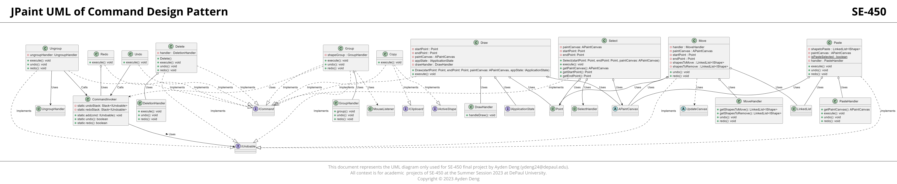
### 3.1.3 Description
1. Classes Included
      - Interfaces: IUndoable, IClipboard, IActiveShape, ICommand, IApplicationState
      - Core: CommandInvoker
      - Commands: Copy, Delete, Draw, Group, Move, Paste, Redo, Select, Undo, Ungroup
      - Handlers: DeletionHandler, DrawHandler, GroupHandler, MoveHandler, PasteHandler
      - Supporting classes: Point, APaintCanvas, UpdateCanvas
2. Design Explanation
      - CommandInvoker: Central to the command pattern, this class manages the execution of commands, specifically tracking undo and redo operations. It contains stacks for managing undo and redo commands.
      - ICommand: This interface serves as the blueprint for command classes. It primarily requires an execute() method which every command needs to implement.
      - IUndoable: An interface that commands can implement if they support undo and redo operations.
      - Commands: Classes like Copy, Delete, Draw, etc., represent concrete commands in the application. They implement the ICommand interface and, in many cases, the IUndoable interface.
      - Handlers: These classes handle the specifics of each command, often encapsulating complex logic associated with command operations.
3. Why Command Pattern?
      - Decoupling: The Command pattern decouples the object that invokes the command (CommandInvoker) from the one that knows how to perform it (Commands and their respective Handlers). This allows more flexibility in object operations.
      - Flexibility in Operations: Commands like undo and redo are easily supported with the Command pattern. A history of operations can be maintained which allows for these complex functionalities.
      - Easy Extension: New commands can be added easily without modifying existing code, adhering to the Open/Closed Principle.
4. What advantages does Command Pattern bring?
      - Modularity and Flexibility: It promotes a more modular design since each command is its own class with a single responsibility. This makes the system more flexible and easier to extend.
      - Undo/Redo Operations: One of the most significant advantages of the Command pattern in GUI applications is the ability to implement undo and redo operations. This is evident in the provided UML with classes implementing IUndoable and the CommandInvoker having undo and redo stacks.
      - Batching and Logging: The Command pattern allows for batching of commands, where multiple commands can be grouped together and executed as a single composite command. Additionally, commands can be logged, enabling a kind of replay of operations if needed.
      - High-level of abstraction: By encapsulating commands into their own classes, it abstracts out the details of how the commands are executed. This promotes a clearer separation of concerns in the application.
      - Easy Integration: New commands can be integrated seamlessly into the existing system without significant changes to the existing codebase.
## 3.2 Composite Pattern
### 3.2.1 UML Diagram
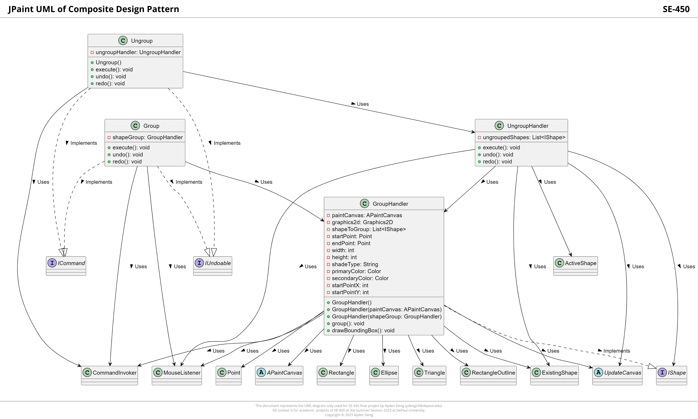
### 3.2.2 Description
1. Classes Included
      - Interfaces: ICommand, IUndoable, IShape
      - Core: CommandInvoker, MouseListener
      - Commands: Group, Ungroup
      - Handlers: GroupHandler, UngroupHandler
      - Supporting classes/components: APaintCanvas, Graphics2D, Rectangle, Ellipse, Triangle, RectangleOutline, Point, UpdateCanvas, ExistingShape, ActiveShape
2. Design Explanation
      - IShape: This is the most crucial interface, acting as the component for the Composite pattern. All shape objects, including groups of shapes (composites), should implement this.
      - Group and Ungroup: These are command classes that manage the grouping and ungrouping operations of shapes. They implement the ICommand and IUndoable interfaces for executing and undo/redo functionalities.
      - GroupHandler: This is the Composite in the Composite pattern. It implements the IShape interface and can contain multiple individual shapes or other GroupHandler objects, making it a composite. It has operations like group() and drawBoundingBox() which show its ability to treat the group as a single shape entity.
      - UngroupHandler: As the name suggests, this class handles the ungrouping operation by breaking down the group into individual shape components.
3. Why Composite Pattern?
      - Hierarchy of Objects: In applications like graphic systems or GUIs, you often have a hierarchy or a structure of objects. Some of these objects are individual items, and others are collections or groups of items. The Composite pattern allows clients to treat individual objects and compositions of objects uniformly.
      - Simplification: With the Composite pattern, clients can use a group of objects the same way they use a single object. This is clear with the GroupHandler which treats a collection of shapes as a single IShape entity.
      - Ease of Expansion: As your application grows, if you want to introduce a new shape or a new group of shapes, the Composite pattern makes it seamless to do so.
4. What advantages does Composite Pattern bring?
      - Uniformity: One of the most significant advantages of the Composite pattern is the ability to treat individual objects and their compositions uniformly. This simplifies client code as it doesn't need to differentiate between a single object and a group of objects.
      - Flexibility: It allows you to compose objects into tree structures to represent part-whole hierarchies. This provides flexibility in building more complex structures from simple components.
      - Ease of Manipulation: As seen with the Group and Ungroup commands, the Composite pattern allows easy manipulation of groups as if they were individual components. For instance, groups can be moved, changed, or extended effortlessly.
      - Reusability: The composite objects can be reused, as they adhere to the same contract as the individual objects. This reusability can save significant development effort and reduce potential bugs.
      - Clear Hierarchy: The pattern defines clear hierarchy and relationships, making the system easier to understand and maintain.
## 3.3 Factory Pattern
### 3.3.1 UML Diagram
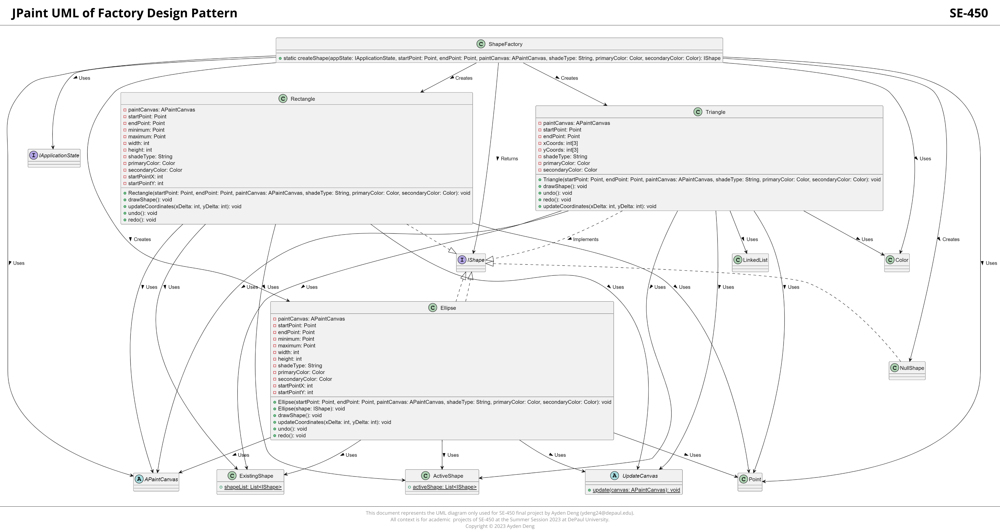
### 3.3.2 Description
1. Classes Included
      - ShapeFactory: The main class responsible for creating various shape objects.
      - IShape: An interface representing any shape.
      - IApplicationState: An interface without any given attributes or methods in the UML.
      - Point: Represents a point in 2D space.
      - APaintCanvas: An abstract class representing a canvas.
      - Color: Represents color.
      - ExistingShape: Holds a list of existing shapes.
      - ActiveShape: Holds a list of currently active shapes.
      - UpdateCanvas: An abstract class for updating the canvas.
      - Rectangle: A concrete implementation of IShape, representing a rectangle.
      - Ellipse: Another concrete implementation of IShape, representing an ellipse.
      - Triangle: Another concrete implementation of IShape, representing a triangle.
      - NullShape: Another concrete implementation of IShape, presumably used as a null object pattern.
2. Design Explanation
      - The ShapeFactory is central to the Factory Design Pattern here. Its primary function is the creation of shapes, namely Rectangle, Ellipse, Triangle, and NullShape.
      - Concrete classes like Rectangle, Ellipse, and Triangle all implement the IShape interface. They have attributes representing their dimensions and colors and methods for actions like drawing the shape, undoing, and redoing.
      - The relationships (--> Creates) from ShapeFactory to shapes like Rectangle, Ellipse, Triangle, and NullShape indicate that the factory is responsible for creating instances of these shapes.
      - The ExistingShape and ActiveShape classes seem to act as repositories or lists to track shapes.
3. Why Factory Pattern?
      - Flexibility: By using a factory to create shapes, the system can easily introduce new shape types without altering the client code.
      - Encapsulation: The logic for object creation is isolated in the factory, which means changes in object creation or initialization will only affect the factory, not the clients.
      - Centralization: A centralized point of object creation ensures consistency across object instantiations.
4. What advantages does the Factory Pattern bring?
      - Simplicity: Clients can create objects without needing to know the specific class required. They only need to call the factory method.
      - Consistency: A factory ensures that objects are created with a consistent initialization process.
      - Modularity: If there's a need to change how objects are created or if a new type of object needs to be introduced, changes can be made only in the factory without affecting client code.
      - Layered Architecture: Separating the object creation logic from the business logic can lead to a more layered and modular architecture.
      - Central Management: If there are post-creation configurations or operations needed for objects, they can be managed centrally in the factory.
## 3.4 Proxy Pattern
### 3.4.1 UML Diagram
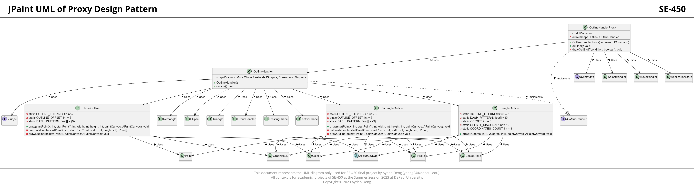
### 3.4.2 Description
1. Classes Included
      - Core Class: APaintCanvas
      - Interfaces: ICommand, IShape, IOutlineHandler
      - Specific Outlines: EllipseOutline, RectangleOutline, TriangleOutline
      - Handler Classes: OutlineHandler
      - Proxy Class: OutlineHandlerProxy
      - Other: Graphics2D, Stroke, BasicStroke, Color, Point
2. Design Explanation
      - APaintCanvas: Appears to be an abstract base class representing a canvas where shapes and their outlines can be drawn.
      - IShape: An interface defining the contract for different shapes.
      - IOutlineHandler: An interface that outlines shape-specific behaviors, which both OutlineHandler and OutlineHandlerProxy implement.
      - EllipseOutline, RectangleOutline, TriangleOutline: Classes responsible for drawing the respective shapes' outlines. They seem to have common properties like OUTLINE_THICKNESS and methods to draw the outline and calculate the points for the outline.
      - OutlineHandler: Responsible for outlining different shapes. It contains a map that relates a shape with its corresponding outline drawing behavior.
      - OutlineHandlerProxy: Acts as a proxy to the OutlineHandler. It introduces some control over the execution of the outlining, perhaps to add additional checks or functionalities like conditionally drawing outlines.
3. Why Proxy Pattern?
      - Control Access: To provide controlled access to the OutlineHandler class. The proxy can add additional behaviors, such as pre- or post-processing, or even decide not to call the original object based on certain conditions.
      - Lazy Initialization: Sometimes, creating an object can be resource-intensive. With a proxy, you can delay the creation of an object until it's truly needed.
      - Security Reasons: If there are operations that require specific security constraints, then using a proxy to validate these constraints before passing the call to the original object is beneficial.
      - In the case of OutlineHandlerProxy, it seems to control when the actual outline operation takes place with its drawOutlineIf method.
4. What advantages does Proxy Pattern bring?
      - Control: As mentioned, the proxy pattern provides a way to control the object instantiation, potentially adding conditions before creating or accessing an object.
      - Flexibility: Proxies can be inserted or removed without affecting the existing system, making it more adaptable to changes.
      - Enhanced Responsibilities: Proxies can enhance the functionalities of the objects they control. For instance, a logging proxy can log the details of method calls, or a cache proxy can cache results of expensive method calls.
      - Separation of Concerns: By separating the actual functionality from the control layer (the proxy), responsibilities are clearly defined and the system design becomes cleaner.
      - In the provided UML: The OutlineHandlerProxy can introduce a level of indirection, allowing it to inspect or modify the behavior of outlining, which can be advantageous in scenarios where conditions or checks are necessary before outlining.
## 3.5 Singleton Pattern
### 3.5.1 UML Diagram
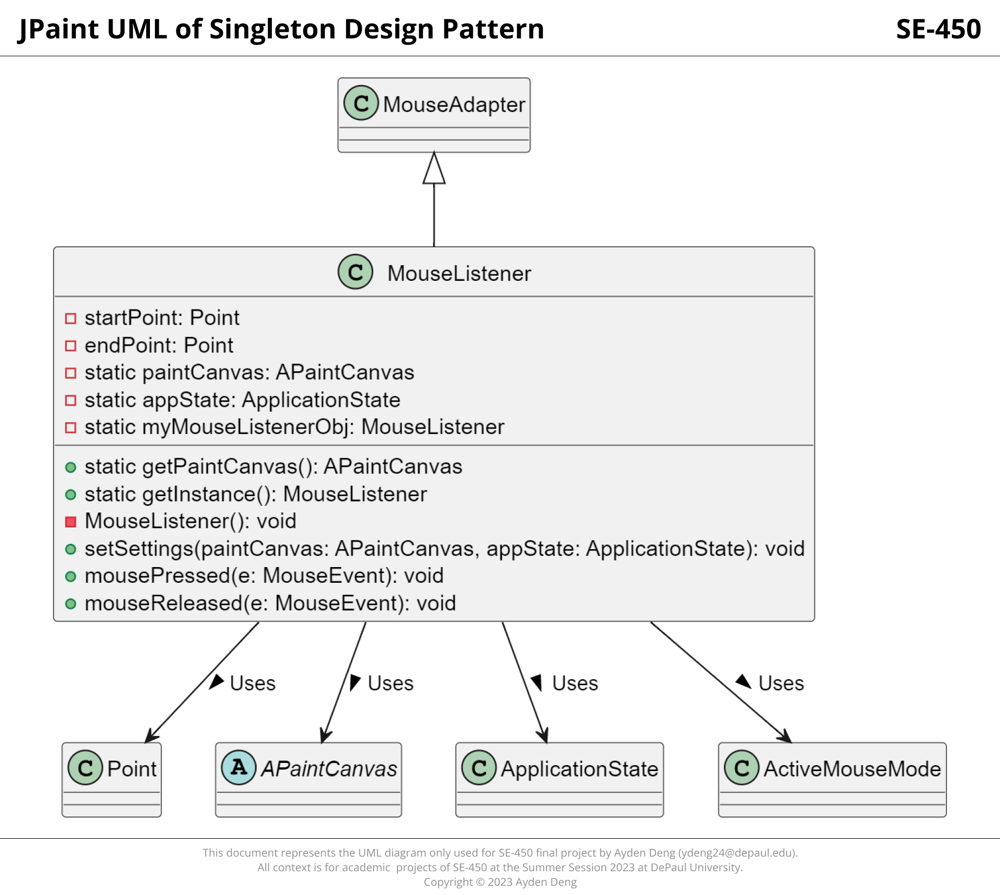
### 3.5.2 Description
1. Classes Included
      - Singleton Class: MouseListener
      - Other Classes: Point, MouseAdapter, APaintCanvas, ApplicationState, ActiveMouseMode
2. Design Explanation
      - MouseListener: The class that is implementing the Singleton pattern. It extends MouseAdapter. The following aspects indicate its Singleton nature:
        - It has a private static instance variable, myMouseListenerObj.
        - It has a private constructor (MouseListener()), ensuring that no new instances of this class can be created from outside this class.
        - The public static getInstance() method provides access to the sole instance of the class.
      - Point: This class likely represents coordinates or positions, which might be utilized to determine where the mouse was pressed or released.
      - MouseAdapter: This appears to be a foundational class that MouseListener extends, possibly to handle mouse events.
      - APaintCanvas: An abstract base class representing the canvas where drawings or graphics are rendered.
      - ApplicationState: This class probably holds the state or context of the application.
      - ActiveMouseMode: This class might indicate the current behavior or mode of the mouse in the application, determining how certain actions are executed based on the mode.
3. Why Singleton Pattern?
      - Unique Instance: It ensures that there's only one instance of MouseListener throughout the application. Given that the mouse listener might need to have consistent behavior and hold certain states (like the current paintCanvas or appState), it's crucial to ensure there's only one such instance managing it.
      - Global Point of Access: With Singleton, you ensure a single point of access to the instance, which can be crucial for managing app-wide behaviors and states like mouse events.
      - Lazy Initialization: Typically, Singleton pattern initializes the instance when it's first needed (lazy initialization). This is evident from the getInstance() method, which would create the instance if it doesn't exist or return the existing one.
4. What advantages does Singleton Pattern bring?
      - Resource Efficiency: You avoid repeated object creation, which could be resource-intensive, especially if initialization involves complex operations.
      - Consistency: With only one instance, you maintain a consistent state throughout the application lifecycle, ensuring that all operations access the same data and behaviors.
      - Easy State Management: Since there's just one instance, managing its state (like startPoint, endPoint, or other attributes) becomes straightforward.
      - Reduced Global Variable Usage: Instead of using global variables, which can lead to unintended modifications from various parts of an application, Singletons provide a controlled way to access and manage a unique instance.
## 3.6 Strategy Pattern
### 3.6.1 UML Diagram
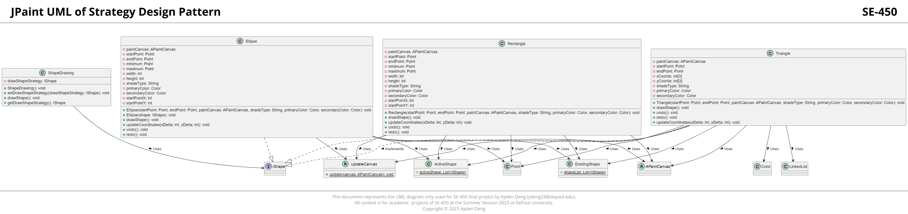
### 3.6.2 Description
1. Classes Included
      - Strategy Interface: IShape
      - Concrete Strategies: Ellipse, Rectangle, Triangle
      - Context Class: ShapeDrawing
      - Other Classes: Point, APaintCanvas, ExistingShape, ActiveShape, UpdateCanvas
2. Design Explanation
      - IShape: This is the strategy interface, which defines a family of algorithms or behaviors.
      - Ellipse, Rectangle, Triangle: These are concrete implementations (strategies) of the IShape interface, each representing a shape and its behavior (how it's drawn, its update coordinates method, undo, and redo actions).
      - ShapeDrawing: This is the context class that uses strategies. It has a strategy (drawShapeStrategy) to delegate the drawing task. The strategy can be set dynamically using setDrawShapeStrategy and retrieved using getDrawShapeStrategy.
      - Other classes: They are supporting classes or external entities. For instance, Point likely captures the x, y coordinates; APaintCanvas might be where shapes are drawn; ExistingShape and ActiveShape might maintain lists of shapes.
3. Why Strategy Pattern?
      - Dynamic Behavior Change: The main purpose is to enable a class to switch between different algorithms or behaviors at runtime without altering its code. In this context, ShapeDrawing can switch between drawing an ellipse, rectangle, or triangle dynamically.
      - Decoupling: Strategy pattern decouples the behavior (how a shape is drawn and its other actions) from the class using it (ShapeDrawing). It promotes the open/closed principle where classes are open for extension but closed for modification.
      - Variation Management: Given that there are various ways to draw shapes, the Strategy pattern allows managing these variations in a clean and modular manner.
4. What advantages does Strategy Pattern bring?
      - Flexibility: By encapsulating each strategy, the system gains the flexibility to add new strategies or modify existing ones without affecting other parts of the code.
      - Maintainability: Individual strategies can be modified or replaced without affecting other strategies or the context class. This makes the system easier to maintain and extend.
      - Reusability: Strategies are typically designed to be reusable across different contexts. For example, the same drawing algorithm for an ellipse could be reused in multiple drawing tools or applications.
      - Testability: Strategies can be tested in isolation from their context, leading to more straightforward unit testing.
      - Clear Separation: It results in a clear separation of responsibilities. The context (ShapeDrawing) is responsible for using the strategy, while the strategy is responsible for the specific behavior.
# 4. Usage
To effectively utilize the JPaint application, kindly follow these steps:
1. Ensure that you have Oracle Java Open JDK 19 or a more recent version installed on your system.
2. Clone or download the JPaint repository from the GitHub repository accessible via this link: JPaint Repository.
3. In a terminal or command prompt, navigate to the root directory of the JPaint project.
4. To compile the Java source files, employ the following command: javac -d bin -cp src src/main/Main.java
5. Launch the application by executing this command: java -cp bin main.Main
6. The JPaint application interface will initiate, affording you the opportunity to commence drawing shapes on the canvas. This can be achieved by engaging the mouse and employing a press-and-drag motion.
# 5. File Structure
The project adheres to the MVC (Model-View-Controller) design pattern, leading to the establishment of the subsequent file structure:
```
JPaint/src
├── controller/
├── main/
├── model/
│   ├── dialogs/
│   ├── interfaces/
│   └── persistence/
└── view/
```
# 6. UI/Application Screenshots
## 6.1 Draw
### 6.1.1 Shape Type Selecting
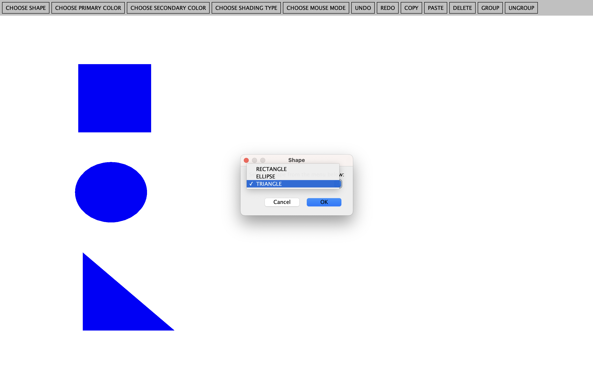
### 6.1.2 Primary Color Selecting
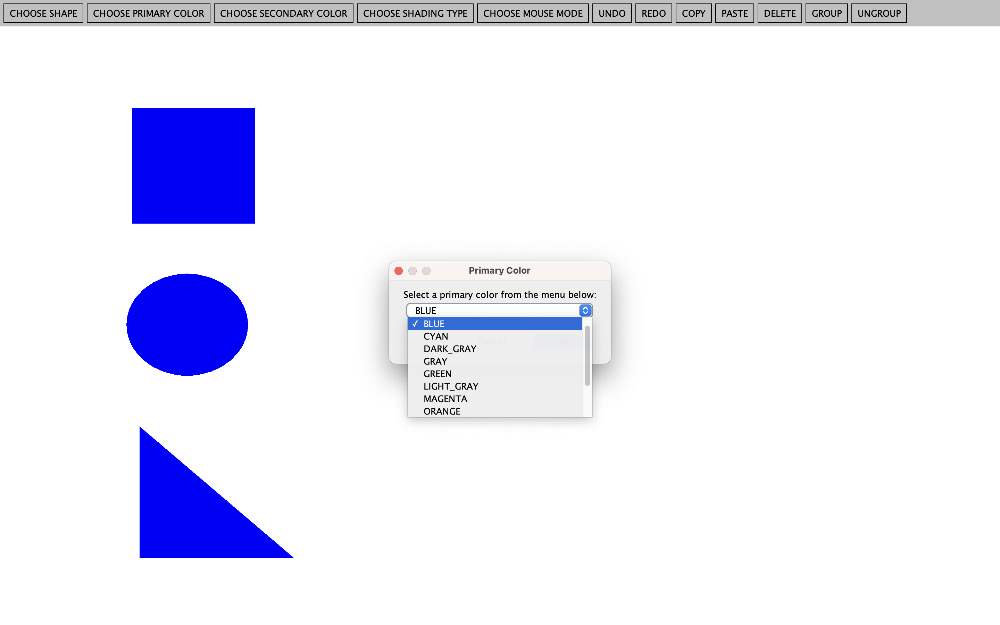
### 6.1.3 Secondary Color Selecting
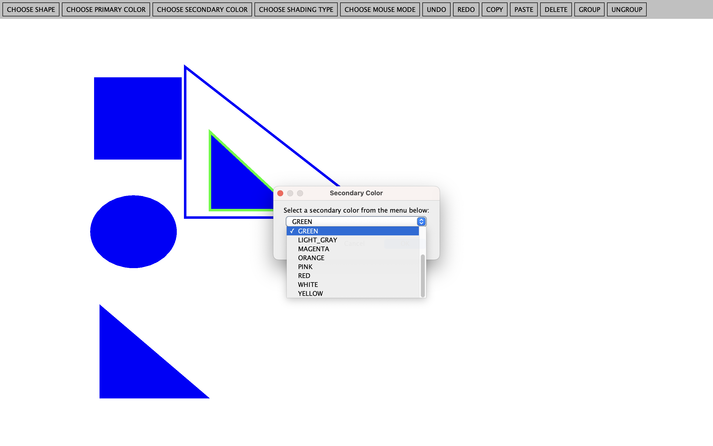
### 6.1.4 Shade Type Selecting
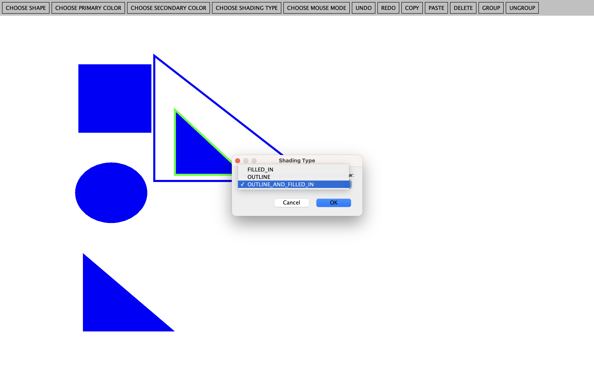
## 6.2 Redo/Undo
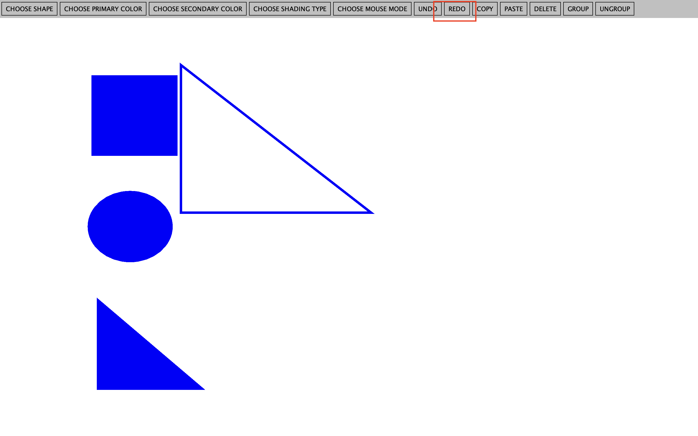
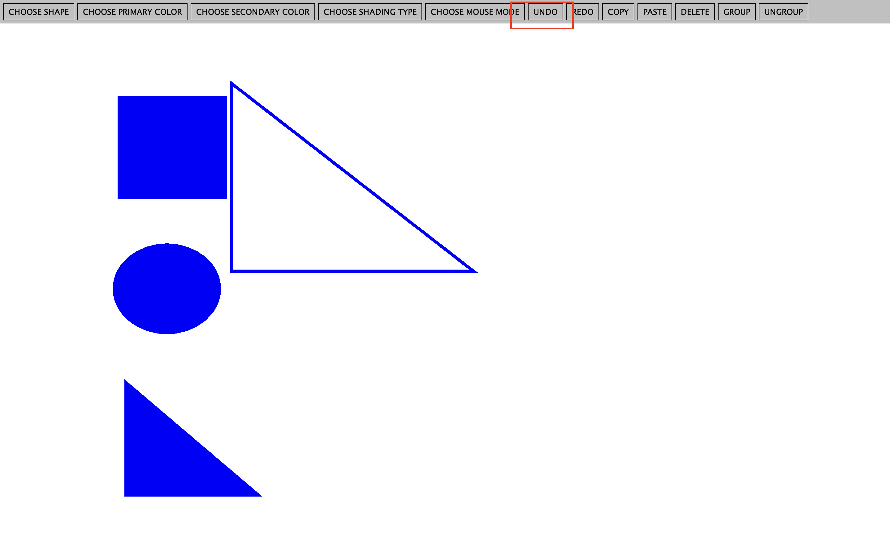
## 6.3 Select 
### 6.3.1 Single Selecting
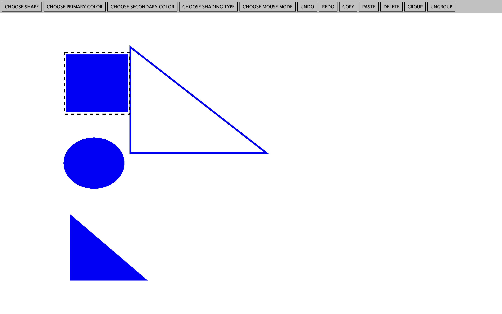
### 6.3.2 Multiple Selecting
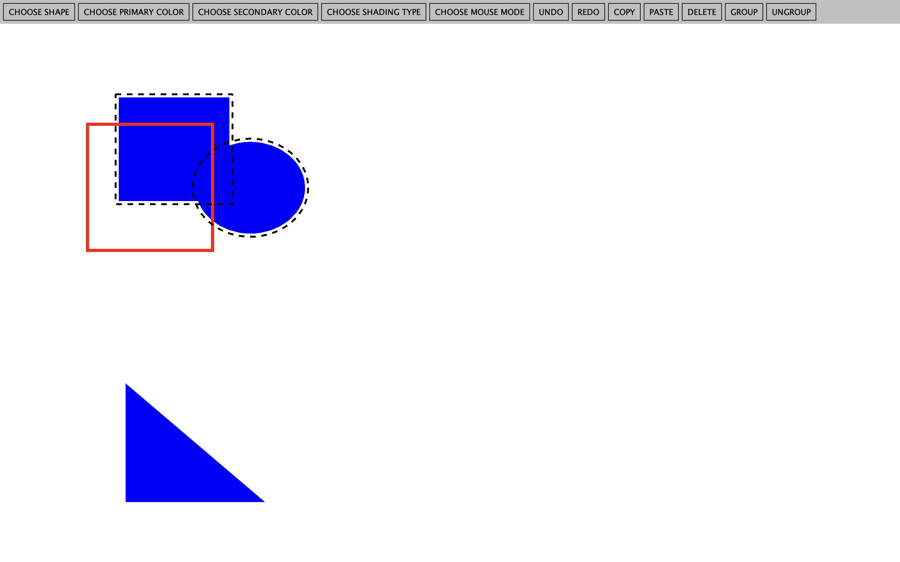
## 6.4 Move
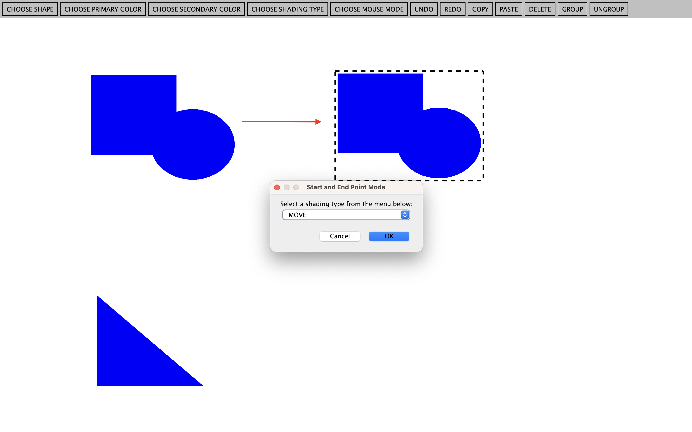
## 6.5 Copy/Paste
### 6.5.1 Copy
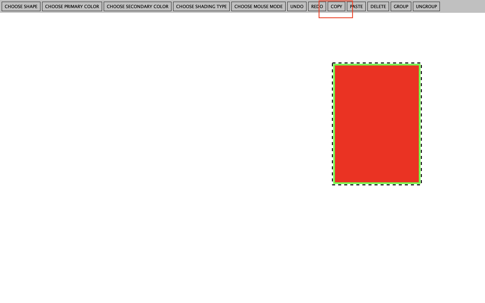
### 6.5.2 Paste
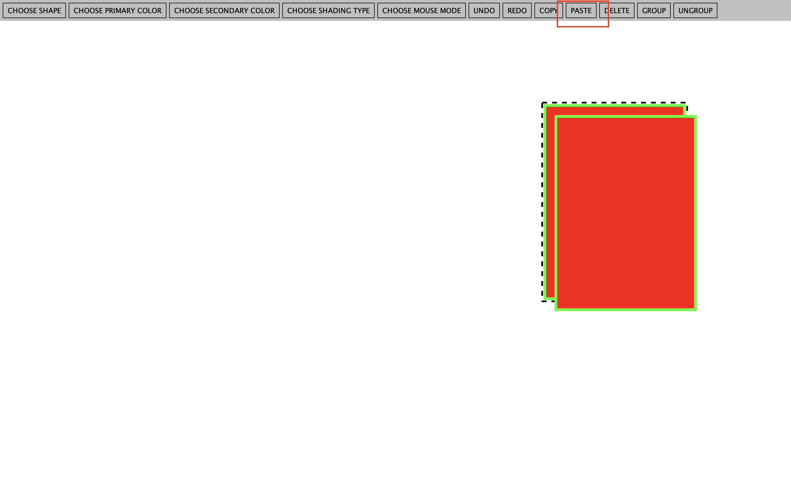
## 6.6 Delete

## 6.7 Group
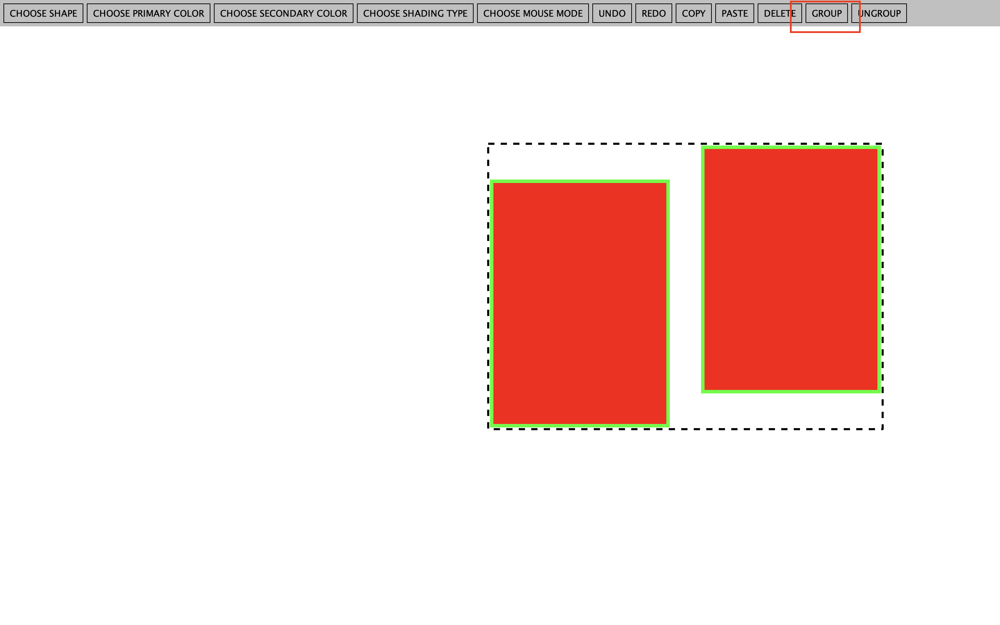
## 6.8 Ungroup


