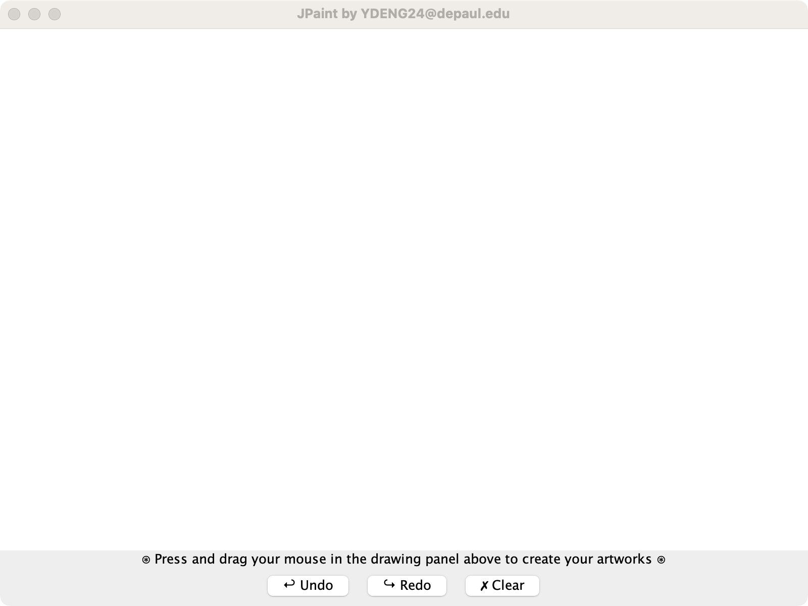
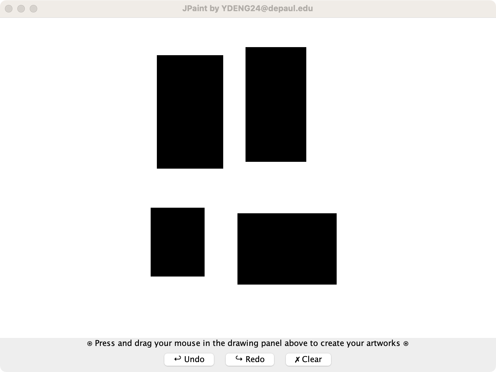

# **JPaint**
JPaint is a simple painting application built in Java that allows users to draw black-filled rectangles by pressing and dragging the mouse. It follows the Model-View-Controller (MVC) design pattern and adheres to the SOLID principles.

* **Version: 1.0**
* **Version Note:** Final Project Check-In 1 (Sprint 1, Ends on Week 4)
* **Last Updated:** July 8, 2023 (Saturday)

## **Repository**
GitHub: **https://github.com/imayden/JPaint.git**

## **Features**
* Drawing black-filled rectangles on the canvas by pressing and dragging the mouse
* Undo and redo functionality to revert and reapply drawing actions
* Clearing the canvas to remove all drawn rectangles
### **Screenshots**



## **Prerequisites**
* Oracle Java Open JDK 19: **https://www.oracle.com/java/technologies/javase/jdk19-archive-downloads.html**
* Required Java libraries: ```java.awt```, ```java.swing```, ```java.util```

## **Build and Run**
To build and run the JPaint application, follow these steps:

1. Install Oracle Java Open JDK 19 or later on your system.

2. Clone or download the JPaint repository from the GitHub repository: https://github.com/imayden/JPaint.git

3. Open a terminal or command prompt and navigate to the project's root directory.

4. Compile the Java source files using the following command:
```
javac -d bin -cp src src/main/Main.java
```
5. Run the application using the following command:
```
java -cp bin main.Main
```
6. The JPaint application will launch, and you can start drawing black filled rectangles by pressing and dragging the mouse.

## **File Structure**
The project follows the MVC design pattern, resulting in the following file structure:
```
command
- Action.java
- ClearAction.java
- DrawAction.java

controller
- DrawingController.java

main
- Main.java

model
- MouseMode.java

view
- gui
-- ButtonPanel.java
-- DrawingPanel.java
-- Gui.java
```

## **Contact**
* Author: Yiming Deng (Ayden)
* DePaul Campus Connect Email: ydeng24@depaul.edu
* Personal Email: ayden.yiming.deng@gmail.com

Feel free to contact me if you have any questions or feedback regarding this project.
